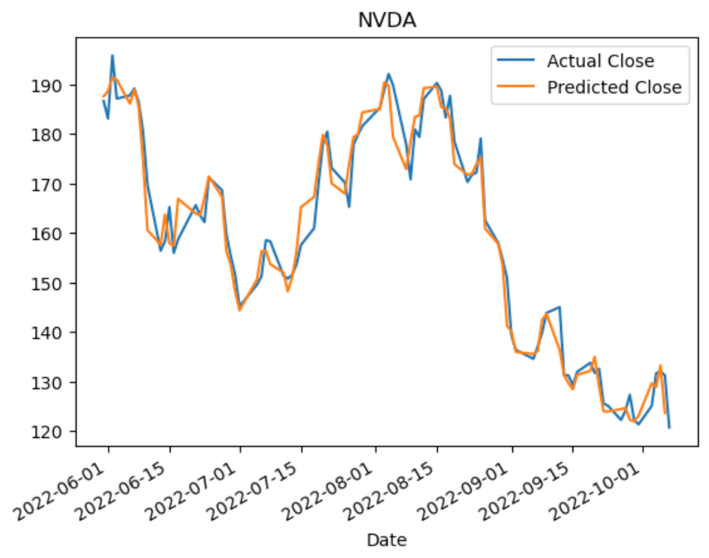

# Trading_Bot

The objectives of this project are as follows: 

* Explore both Algorithmic trading strategies and machine learning models to generate buy/hold/sell signals, and backtests both approaches
    
* Develop a Trading Bot app that can carry out live trading automatically on Alpaca Markets based on trading signals generated by a trained machine learning model.

For the purpose of this project, stocks with higher beta and high liquidity are picked, viz AMD and NVDA. Four years worth of daily Open, High, Low, Close, Volume (OHLCV) data were downloaded, using pandas-ta libraries. In order to see sufficient 'actions' durinng the course of this project, 2 months worth of 5 minutes data were downloaded using yfinance to run through machine learning models.

For Algorithmic Trading, the Simple Moving Averages method were used. A number of combinations of short windows and long windows were tested, and a 4-day short window and 20-day long window was found to be optimal in generating buy/sell signals that enabled the algorithm to generate a profit.

For Machine Learning, XGBoost library was used. To train the model, trading signals were generated using a momentum strategy, ie. if daily close price percentage change is greater than zero, a '1' signal is generated, otherwise a '0' signal is generated '0' Features are used to train the model with the signal as target. For daily data, 26 features with a combination of technical indicators and date parts were used to train the model. For the purpose of live trading and to simply the live trading codes, 5 minutes OHLCV data were used to train the model and the trained model is saved in a file. The trained model file is used by the live trading bot to generate buy/sell signals from live 5 minutes data.

The Long-Short Term Memory (LSTM) deep learning model was also used to predict stock prices, based on Open, High, Low, Volume data. The Close prices were used as the training target. Four years worth of daily Open, High, Low, Close, Volume (OHLCV) data were downloaded. The first 917 rows were used for training, and the last 91 rows were used for testing/prediction. The results showed that the LSTM model was able to rather accurately predict the Closing prices just based on the OHLV features.

The Jupyter lab codes for Algorithmic Trading and Machine Learning are organized in blocks so that each blocks (eg. technical indicators, trading signal generator, machine learning model), can be easily replaced with alternate verions, leaving the backtest blocks in place. This enables various Algorithmic Trading and Macine Learning models to be run and backtested.

An important product of this project is the live trading bot. The live trading bot for this project is configured to do live paper trading on Alpaca Markets. It could be re-configured to do actual live trading on Alpaca Markets or other on-line brokerage platforms.

The live trading bot is developed to run as a Streamlit python app, which can be run on a local PC. This app is also deployed on an Amazon EC2 Linux instance to carry out live paper trades on Alpaca Markets for a 2 week period.

---

## Technologies

This application uses the following packages/modules:

* [Pandas](https://github.com/pandas-dev/pandas)
* [sklearn](https://scikit-learn.org)
* [XGBoost](https://xgboost.readthedocs.io)
* [Keras](https://keras.io)
* [TensorFlow](https://www.tensorflow.org)
* [Pandas-TA](https://pypi.org/project/pandas-ta/)
* [hvPlot](https://hvplot.holoviz.org)
* [requests](https://pypi.org/project/requests/)
* [Python json](https://docs.python.org/3/library/json.html)
* [alpaca_trade_api](https://alpaca.markets/deprecated/docs/api-documentation/)
* [Python-dotenv](https://pypi.org/project/python-dotenv/)
* [Python datetime](https://docs.python.org/3/library/datetime.html)

---

## Usage

The main file for Algorithmic Trading is main_Algo_Trading.ipynb. The file in this repository uses the NVDA ticker, and Simple Moving Averages (4 / 20 windows) as technical indicators. The ticker can be changed at the beginning of the file. The section 'Algorithmic Trading using Simple Moving Averages Technical Indicators' can be replaced with codes using other technical indicators. 

The Jupyter Lab files in this repository that performs machine learning and backtesting come in the following flavors:

 - main_ml_XGB_AMD_daily.ipynb - live daily data for AMD ticker, with 26 features for machine learning model training

 - main_ml_XGB_NVDA_daily.ipynb - live daily data for NVDA ticker, with 26 features for machine learning model training

 - main_ml_XGB_NVDA_5mins_OHLCV.ipynb - live 5 mins data with OLHCV as features for machine learning model training

 - main_ml_LSTM.ipynb - live daily OHLCV data. LSTM model is used to train the machine learning model to predict the Closing prices.

The live trading bot, 'trading_bot_paper_live_streamlit.py', downloads 5 minutes OHLCV data for a specific ticker, and carries out buy and sell on Alpaca Market platform. The command to run this file in Terminal is 'streamlit run trading_bot_paper_live_streamlit.py'. If the file is run on a local PC, a webpage will be launched showing the status of the trades. If the file is run on the server in the cloud, the IP address of the accessible web page will be provided by the server. 

Note: Alpaca Markets API keys (available for free with registration) keys are required for the live trading bot. The API Keys must be stored in a .env file in the same directory as bot directory, with the following line in the file (the keys below are examples):

ALPACA_API_KEY = ABCD1234

ALPACA_SECRET_KEY = B819AL9B

---
## Contributors

This application is written by James Tan, Patrick Ball, Taofik Sulaiman, Liz Panza, Jimmy Chow and Matthew Ho.

---

## License

MIT License.